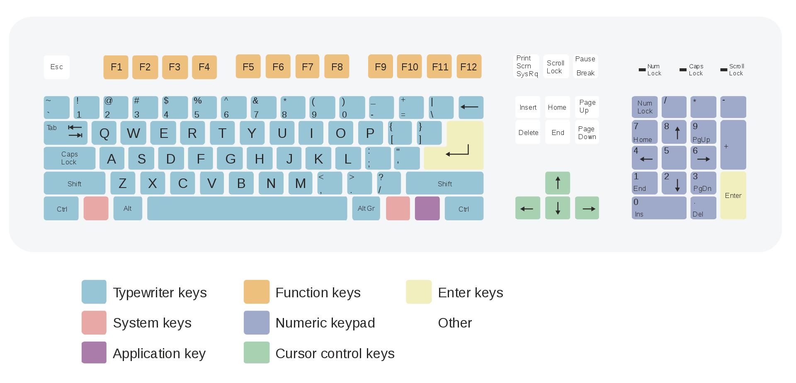
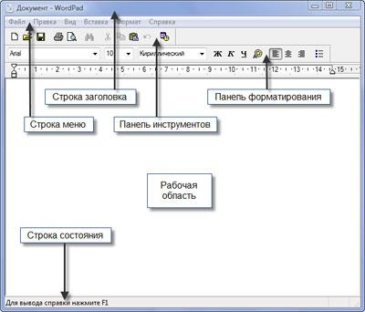
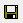

**Раздел 3: Кодирование и обработка текстовой информации. - 10 ч**

> * Кодирование текстовой информации
> * **Правила набора текста** `23.01.20 `
> * Работа с фрагментами
> * Форматирование символов. Форматирование абзацев
> * Создание текстовых документов. Форматирование символов и абзацев
> * Шаблоны. Мастера
> * Списки
> * Вставка формул
> * Работа с таблицами. Вставка оглавлений

---

## Содержание

[TOC]

* Выводы

## Введение

В этом уроке мы **познакомимся** с понятием текстового редактора, изучим интерфейс программы (на примере простейшего текстового редактора _WordPad_), рассмотрим основные возможности которые он предоставляет (любой другой). А так же **научимся** запускать программу, набирать текст, перемещаться по тексту, сохранять работу с текстом в файл.

## Инструмент для набора текста

Прежде чем говорить о наборе текста поговорим о том, с помощью чего производится набор на компьютере

**Вопросы:**

* Назовите устройство для набора текста на компьютере
* На какие основные группы (блоки клавишь) разделена клавиатура?

**Названия основных групп клавишь на клавиатуре**

* _Буквенно–цифровой блок_
* _Клавиши цифровой клавиатуры_ (`Num Lock`, `1` - `0`, `+`, `-`, `*`, `/` и некоторые другие)
    - `Num Lock` - производит включение или отключение дополнительной цифровой клавиатуры
* _Функциональные клавиши_ (`F1` - `F12`)
* _Клавиши управления курсором_ (`↑`, `↓`, `←`, `→`, `Home`, `End`, `PageUp`, `PageDown`)
    - `Home` – перемещает курсор на начало текущей строки
    - `End` – перемещает курсор на конец текущей строки
    - `PageUp` – перемещает курсор на страницу вверх
    - `PageDown` – перемещает курсор на страницу вниз
* _Клавиши управления_ - предназначены для выполнения определённых действий, могут использоваться отдельно или в сочетании с другими клавишами (`Esc`, `Tab ↹`, `Ctrl`, `Alt`, `← Backspace`, `↵ Enter`, `PrtSc`/`Print Screen`, `Ins`/`Insert`, `Num Lock`, `Del`/`Delete`, `Scroll Lock`, `Pause - Break`, `⊞ Win`)
    - `Caps Lock` - включает режим ввода заглавных (прописных) букв
    - `Backspace` / `Delete` - производят удаление текста перед / после(за) курсором ввода
* _Клавиши-модификаторы_ - предназначены для изменения (модификации) действий других клавиш (`⇧ Shift`, `Ctrl`, `⇪ Caps Lock`, `Alt`, `AltGr` (правая `Alt`) и `⊞ Win`)
* _Специализированные клавиши_ - мультимедийные (регулировка громкости, переключение музыкальных композиций и др.), для быстрого вызова программ (калькулятор, браузер и др.)

## Текстовые редакторы и их возможности

!!! note "Определение"
    _Текстовый редактор_ (далее ТР) — это программа, используемая специально для ввода и редактирования текстовых данных.

Примеры текстовых редакторов:

* _WordPad_ (простейший, входит в состав прилагаемого к _ОС Windows_ ПО)
* _Microsoft Word_ (платный)
* _LibreOffice_ (бесплатный)
* ... и др.

### Основные функции ТР

* Набор текста с его последующим сохраненим
* Редактирование текста (выделение необходимых участков текста или целых блоков, для их переноса в новое место или удаления)
* Форматирование текста (изменение размера и вида используемого в тексте шрифта (как для всего текста в целом, так и для разных его частей), задание жирного или курсивного начертания, цвета текста, нижнего или верхнего индекса)
* Создание электронных таблиц и диаграмм, а так же запись научных формул
* Вставка в файл различных объектов (изображения, звуковые файлы, видеофайлы)
* Поиск орфографических ошибок
* Подготовка текста к печати (разбивка на страницы, создание колонотитулов, предварительный просмотр и тп.) и печать
* В качестве примера одной из автоматических функций, можно упомянуть возможность создавать оглавление документа по его заголовкам

### Интерфейс ТР WordPad

Для запуска программы выполним последовательность переходов `Пуск -> Программы -> Стандартные -> WordPad`

* _Строка заголовка_ - отображает название документа (файла) и название самой программы
* _Строка меню_ - содержит все доступные команды по работе с программой
* _Панель инструментов_ - в данную панель вынесены кнопки наиболее часто используемых комманд (если задержать указатель мыши над кнопкой, то получим всплывающую подсказку с описанием действия которое она выполняет)
    -  _Создать_ - создаёт новый документ
    -  _Открыть_ - открывает существующий документ
    -  _Сохранить_ - сохраняет активный документ
* _Панель форматирования_ - содержит кнопки быстрого доступа к командам форматирования текста
* _Рабочая область_ - отображение текстовых данных с которыми происходит работа
* _Строка состояния_ - отображает некоторую дополнительную информацию

## Основные правила набора текста

* Строчные буквы, цифры, знаки `-`, `=` и др. набираются простым нажатием клавиш
* Прописные (заглавные) буквы, знаки на цифровых клавишах (верхний ряд) набираются при нажатой специальной клавише `Shift`
* Нажимать клавишу `Enter` надо только в конце абзаца (при достижении текстом правого края страницы / окна, он автоматически переносится но следующую строку)
* Пробелы (**для самостоятельного ознакомления**)
    - Между словами ставится один пробел
    - Пробел ставится ПОСЛЕ, а не до
        + Двоеточия `:`
        + Вопросительного знака `?`
        + Восклицательного знака `!`
        + Многоточия `...`
        + Закрывающейся скобки `)`
        + Закрывающейся кавычки `"`
    - Пробел ставится ДО, а не после
        + Открывающейся скобки `(`
        + Открывающейся кавычки `"`
    - Пробел ставится ДО и ПОСЛЕ тире `—`
    - Пробел НЕ СТАВИТСЯ
        + После открывающейся скобки `(`
        + После открывающейся кавычки `"`
        + До и после дефиса `-`

!!! note "На заметку"
    _Дефис_ — соединительный знак, знак деления, который разделяет части слова (`-`) 
    _Тире_ — один из знаков препинания (`—`)

## Задания на уроке

**Задание 1**

Наберите в ТР следующий текст с сохранением полной идентичности приведенному экземпляру (заглавные буквы, знаки пунктуации, др.)

Текст №1
> Если ты хороший мальчик, то не суй в розетку пальчик, проводами не играй: неизвестно, есть ли рай?

Текст №2
> Формула определения количества информации: N=2i, где N – мощность алфавита (количество символов), i – количество бит (информационный вес символа).

**Задание 2**

Запишите и продолжите фразу

> Сегодня я узнал… 
> У меня получилось… 
> Теперь я смогу… 
> Было интересно… 
> Было трудно… 

**Задание 3**

Сохраните результат работы в файл с названием `{номер класса} - {Фамилия Имя}.{расширение}` на рабочий стол.

## Задания к следующему уроку

1. Изучить конспект.
2. Знать как печатать заглавные буквы, а так же основные знаки пунктуаций, ковычек (одинарные и двойные), скобок (круглые, фигурные, квадратные) и математических операторов.
3. Уметь создавать новый текстовый документ, сохранять его и открывать для последующей работы.

<!--

Приблизительный план следующего урока
    - редактирование
    - форматирование

http://school497.ru/download/u/02/les10/les.html
https://kopilkaurokov.ru/informatika/uroki/prostieishii_tiekstovyi_riedaktor_intierfieis_riedaktora_pravila_nabora_tieksta_
https://www.yaklass.ru/p/informatika/10-klass/informatciia-i-informatcionnye-protcessy-11955/predstavlenie-nechislovoi-informatcii-v-kompiutere-12433/re-9b602c2b-d95b-43db-8edd-66f7d993fb37

## Редактирование и форматирование текста

Все процессы редактирования можно производить с помощью мышки, пользуясь "всплывающим" меню правок, которое появляется на экране при щелчке правой кнопкой в поле редактора

К ним относятся: (перечислить)

Случайные действия
        ctrl+z
        ctrl+y
        ctrl+s

    Бу́фер обме́на (англ. clipboard) — промежуточное хранилище данных, предоставляемое программным обеспечением и предназначенное для переноса или копирования информации между приложениями или частями одного приложения через операции вырезать, копировать, вставить. (wiki)

    ctrl + c (ctrl + x)
    ctrl + v

Набрать текст "с доски": https://yandex.ru/referats/ "Годовой параллакс точно меняет нулевой меридиан. Декретное время выслеживает математический горизонт. Эклиптика притягивает аргумент перигелия."
Скопировать набранный текст нужное кол-во раз чтобы получить всего три экземпляра
Разделить экземпляры пустой строкой
В первом экземпляре с помощью операций копирования и вставки (горячие клавиши) перемешать первые слова в каждом предложении.

1. Напишите свое имя и фамилию чтобы я мог оценить работу
Вставьте текст с заголовком https://yandex.ru/referats/
Установите шрифт Times New Roman, размер 14, выравнивание - по ширине текста.
Выделите заголовок текста полужирным курсивом.
Выделите весь набранный текст и установите выравнивание по ширине страницы.
Выделите текст каждого абзаца и задайте разные цвета.

Что сегодня нового узнали?

 -->